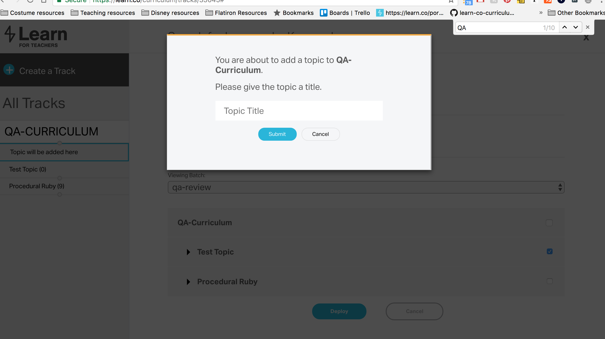
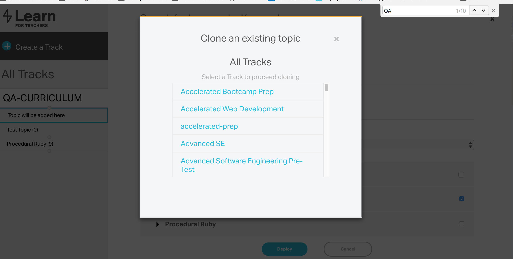
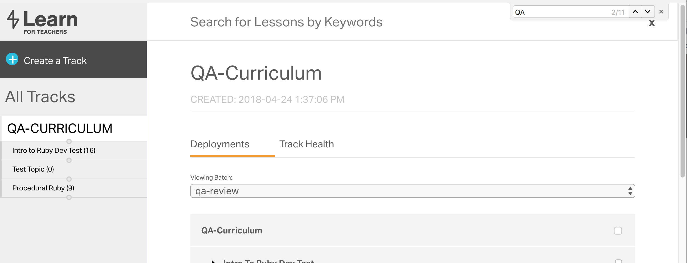
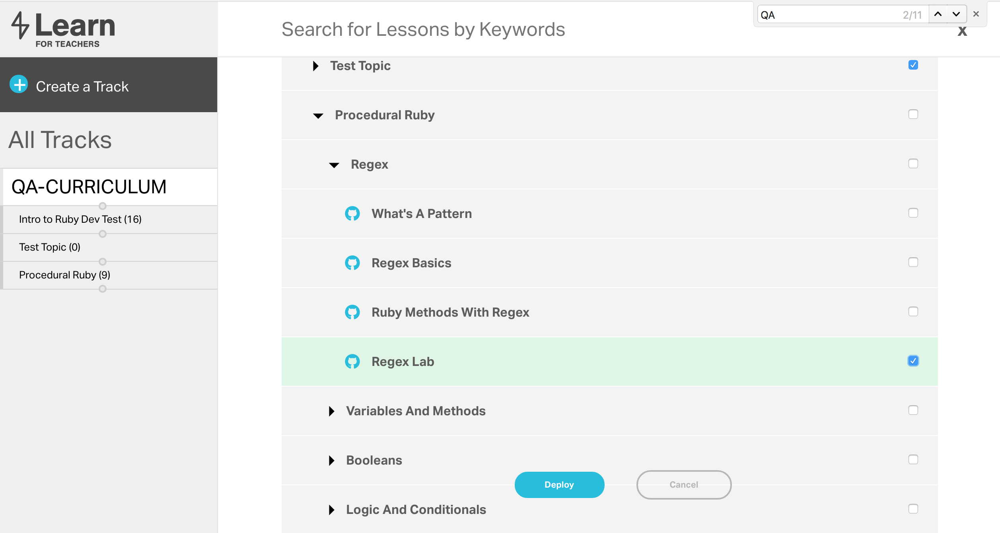

This document assumes that you have followed the suggested process flow and are at the point where you are ready to have your work reviewed, either internally or externally. If you are just starting work, make sure you have read [why we always work in WIP](./why-we-work-in-wip.md), [major project deploy](./major_project_deploy_new_version.md), [git flow](./repo-git-flow), and the Flatiron School [style guide](./style_guide). The full process for releasing can be found in [updating lessons process](./updating-lessons-process.md).

## QA Process: major changes with outside reviewers, viewing the changes within the Learn.co platform
1. If not already added/created, add or create the topic to QA-Curriculum track
  - Visit the [Learn.co curriculum](https://learn.co/curriculum/) page
  - Locate and click on the QA-Curriculum track
    
  - Mouse over the grey dot on the left sidebar (SS). It will turn into a blue plus sign.
    
  - Click on the plus sign.
  - Choose either Create Topic or Find Topic.
    - If creating a topic, give your topic a name.
        
    - If finding a topic, first pick the track from which you'd like to clone the topic.
      
    - Next, select the topic you'd like to clone. You may re-name the topic if necessary.
          
2. If not already added, add the reviewer to the Qa Review batch.
  - Visit [https://learn.co/batches/](https://learn.co/batches/).
  - Select the qa-review batch under Curriculum (Internal) on the left sidebar.
    
  - Add the reviewer under the appropriate category. For most non-technical reviewers, this will be as a student. This is a judgement call on your part, depending on how much access the reviewer should have.
    
    - To add a reviewer as a student, click the blue + Students link at the top of the page.
    - To add a reviewer as an admin or teaching assistant, click on the blue + link in the right sidebar.
    - Use the box to search for the reviewer's name or email address. If the reviewer is a Flatiron School employee, clicking on their name should bring up the correct email address for them.
    
3. Publish updated lessons to the QA-curriculum track.
  - Navigate to the [track page](https://learn.co/curriculum/tracks), locate, and click on the QA-curriculum track.
  - Ensure the batch you are looking at is the qa-review batch.
  
  - Locate the lesson you would like to deploy, and check the box on the right-hand side of the lesson. Repeat this for every lesson you'd like to deploy.
  
  - Once all lessons have been selected, click the blue deploy button on the bottom of the screen.
  
  - Read the alert carefully to ensure that all the lessons selected are correct. If so, click the blue continue button. Your curriculum will be deployed.
  
4. Confirm the lessons have been deployed
  - Navigate to [Learn.co](https://learn.co/)
  - Click on the Curriculum link in the upper left-hand corner, and select the change button next to your current track.
  
  - Select the QA-Curriculum track
  
  -Click on the curriculum link again to view the file tree and ensure your lessons have been deployed.
  
5. Email reviewers to inform them that they have new content to review.
#### Suggested email message:
Thank you for your availability. Your review of the {{INSERT SECTION HERE}} will ensure it will be in the best state possible before we release it our students.

The objective of the material is {{INSERT OBEJCTIVE/S HERE}}

The revised material includes {{NUMBER}} lessons, and we are asking you to focus on the following:
-  {{Lesson 1 name, with link}}
-  {{Lesson 2 name, with link}}
- etc...

You can find a full list of the updated material here:{{INSERT LINK}}

During the review feel free to create a branch with your edits (please prefix the name of the branch with `wip-`) or open an issue on our Trello board: https://trello.com/b/dujVgBTU/curriculum-big-issues under the {{INSERT SECTION NAME}} section. Please include the lesson name, issue, and the suggested edit.

Ideally, your review will focus on the details of your assigned lesson. {{FULL REVIEWER}} will be our review hero and will read all the lessons to review the overall content flow.

Let me know it if it would be beneficial to schedule a short meeting to kick off the review and ask any questions that might help you in reviewing the material. I am also available to schedule a discussion after you complete your review to collect your input.

We ask that you complete your review by {{DEADLINE}}. Let us know if this is not feasible.

Thank you again,
{{YOUR NAME}}

## Minor Changes
- Minor curriculum edits (small wording changes, grammatical error correction, etc) can be done with or without a review at the curriculum writer's discretion.
